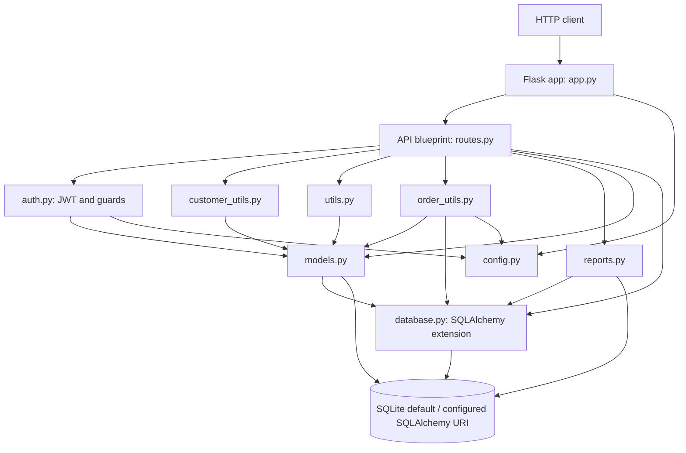

# As-Is Architecture

## Scope and Method

This document describes behavior visible in the repository's current Python source, README, dependency manifest, and tests. It does not infer intended design. `seed_notes.md` was not consulted. External deployment behavior, production database configuration, and integrations not represented in source are Unknown.

## System Inventory

| Area | As-is finding | Evidence |
|---|---|---|
| Entry points | Importing `app.py` creates module-global `app`; direct execution runs Flask on `127.0.0.1:5000`. | `app.py`: `app = create_app()`, `if __name__ == "__main__"` |
| App creation | `create_app()` configures Flask, initializes SQLAlchemy, registers `api`, adds a catch-all exception handler, creates tables, and seeds an empty database. | `app.py`: `create_app`, `seed_data` |
| API routing | One Flask blueprint with prefix `/api`; 19 declared route handlers. | `routes.py`: `api`, route decorators |
| Authentication | Password hashes use Werkzeug; login returns a PyJWT HS256 token; protected routes read `Authorization: Bearer ...` and look up the user by token `user_id`. | `routes.py`: `register`, `login`; `auth.py`: `create_token`, `current_user` |
| Authorization | `login_required` checks for a resolvable user; `admin_required` additionally checks the current database user's `role`. Per-resource ownership checks are inconsistent. | `auth.py`; order/customer handlers in `routes.py` |
| Database | SQLite by default (`sqlite:///legacy_orders.db`); URI can be overridden by `DATABASE_URL`. SQLAlchemy via Flask-SQLAlchemy. | `config.py`, `database.py` |
| Data access | ORM queries and `db.session` operations are used in route/helpers; sales report uses raw SQLAlchemy `text()`. | `routes.py`, `order_utils.py`, `reports.py` |
| Configuration | Environment variables: `DATABASE_URL`, `JWT_SECRET`, `FLASK_DEBUG`; fixed `TAX_RATE` and `DEFAULT_PAGE_SIZE`. | `config.py` |
| External libraries | Flask, Flask-SQLAlchemy, PyJWT, Werkzeug, pytest, requests are declared. `requests` has no observed source import. SQLAlchemy is used directly through Flask-SQLAlchemy/transitive package. | `requirements.txt`; Python imports |
| External integrations | No outbound API/client integration is evidenced. `requests` is declared but unused in source. Payment handling creates a local payment record; no payment gateway is called. | `requirements.txt`, `routes.py`: `pay_order` |
| Background processing | No task queue, scheduler, worker, or asynchronous job mechanism is evidenced. | Repository source inventory |
| Logging | Standard-library logger in `utils.py` logs failed payment details; no application logging configuration is present. | `utils.py`: `logger`, `log_payment_failure` |
| Error handling | App-level `Exception` handler returns message and exception class with HTTP 500. Order creation and reports add local exception handling; validation/HTTP errors have route-specific JSON. | `app.py`: `handle_error`; `routes.py` |
| Tests | One pytest module with a client fixture and five tests. | `tests/test_basic.py`; `pytest.ini` |

## REST Endpoint Inventory

The table lists decorators and access guard observed in `routes.py`; “No decorator” means the handler has no route-level authentication guard in source.

| Method | Path | Guard | Handler |
|---|---|---|---|
| POST | `/api/register` | No decorator | `register` |
| POST | `/api/login` | No decorator | `login` |
| GET | `/api/customers` | `login_required` | `customers` |
| GET | `/api/customers/<customer_id>` | `login_required` | `customer` |
| POST | `/api/customers` | `login_required` | `add_customer` |
| PUT | `/api/customers/<customer_id>` | `login_required` | `update_customer` |
| DELETE | `/api/customers/<customer_id>` | `admin_required` | `delete_customer` |
| GET | `/api/products` | No decorator | `products` |
| GET | `/api/products/<product_id>` | No decorator | `product` |
| POST | `/api/products` | `admin_required` | `add_product` |
| PUT | `/api/products/<product_id>` | `login_required` | `update_product` |
| GET | `/api/orders` | `login_required` | `orders` |
| GET | `/api/orders/<order_id>` | `login_required` | `get_order` |
| POST | `/api/orders` | `login_required` | `add_order` |
| PUT | `/api/orders/<order_id>/status` | `login_required` | `update_order_status` |
| DELETE | `/api/orders/<order_id>` | `login_required` | `delete_order` |
| POST | `/api/orders/<order_id>/payment` | `login_required` | `pay_order` |
| GET | `/api/orders/<order_id>/payment` | `login_required` | `get_payment` |
| GET | `/api/reports/sales` | `admin_required` | `report_sales` |

The 19 route entries above are those present in the source. The paths and methods are confirmed directly by decorators. `customer_id`, `product_id`, and `order_id` are Flask integer converters.

## Logical Components

| Component | Responsibility and important files | Dependencies and callers | Architectural concerns visible in source |
|---|---|---|---|
| Application bootstrap | `app.py`: Flask factory, blueprint registration, schema creation, seed records, global exception handler, development server. | Imports `config`, `database`, `models`, `routes`, Werkzeug; `routes.api` is registered. | App construction has import-time side effects via module-global `app`; startup performs schema creation and conditional data seeding. |
| Presentation/API | `routes.py`: route registration, request parsing, response serialization, validation, authorization decorators, and much CRUD/business orchestration. | Called by Flask; imports all domain models and most service/helper modules. | The route module is a high-fan-out integration point and mixes transport, access checks, persistence, and workflow decisions. |
| Authentication | `auth.py`: token creation/validation, current-user lookup, `login_required`, `admin_required`. | Uses Flask request/JSON responses, PyJWT, config secret, and `User`; route decorators and handlers use it. | Token carries `role`, while `admin_required` consults the loaded current database user; broad exception handling during token parsing collapses all failures to unauthenticated. |
| Business operations | `order_utils.py`: order total calculation and order creation, stock checks/decrement, item creation, tax. `routes.py` also implements payment and status workflows. | `routes.add_order` calls `create_order`; helper uses models, database session, and tax config. | Order workflow crosses route and utility boundaries; payment/status behavior stays in routes. The total-calculation helper is not called by current source. |
| Data access/persistence | `database.py`: singleton SQLAlchemy extension and app binding. ORM model queries/session calls occur directly in routes and helpers; `reports.py` executes SQL. | `app.py` initializes extension; models/helpers/routes/report depend on it. | Persistence is not isolated behind repositories; commit/rollback ownership is distributed. |
| Domain/model layer | `models.py`: six SQLAlchemy table models: `User`, `Customer`, `Product`, `Order`, `OrderItem`, `Payment`. | Depends on `database.db`; imported by app, routes, auth, and helper modules. | Models declare foreign keys but no ORM relationship properties or explicit cascade behavior. Several lifecycle constraints are not expressed as model constraints. |
| Shared/customer utilities | `utils.py`: product serialization/validation, date parsing, stock lookup, payment failure logging. `customer_utils.py`: customer serialization, phone normalization, email lookup. | Imported primarily by `routes.py`; `utils` queries Product and `customer_utils` queries Customer. | `utils.py` groups unrelated product, date, stock, and payment-logging functions. Several helpers have no current call sites. |
| Configuration | `config.py`: environment-backed DB URI/JWT secret/debug flag and fixed tax/page-size values. | Imported by bootstrap/auth/order helper. | Module-level values are evaluated at import time; fallback secret and debug default are committed in source. `DEFAULT_PAGE_SIZE` is not used. |
| Reporting | `reports.py`: aggregates order count and revenue by status for a start/end date query; `routes.py` exposes it. | Route calls `sales_report`; report uses Flask request context, SQLAlchemy text, and shared db session. | Query is assembled by concatenating request parameters into SQL; report implementation is coupled to HTTP request context. |

## Runtime Relationship Diagram

## Runtime and Persistence Notes

- `app.py` sets `DATABASE_URL` and `DEBUG` keys, then `database.init_db()` maps the former to SQLAlchemy's `SQLALCHEMY_DATABASE_URI`.
- A normal import of `app.py` calls `create_app()`, which enters app context, invokes `db.create_all()`, and invokes `seed_data()`.
- `seed_data()` returns if any `User` exists. Otherwise it creates three users, two customers, and three products, then commits.
- Order creation commits inside `order_utils.create_order`; surrounding handler rolls back only when that helper raises before completing. Other handlers commit locally.
- No migrations, explicit connection pool settings, deployment WSGI configuration, or production database settings are evidenced. Their presence outside this repository is Unknown.

## Evidence and Traceability

- `app.py`: `create_app`, `seed_data`, module-level `app`, `__main__` runner, `handle_error`.
- `routes.py`: `api` and all route decorators/handlers; request parsing, guards, persistence calls, workflows.
- `auth.py`: `create_token`, `current_user`, `login_required`, `admin_required`.
- `database.py`: `db`, `init_db`.
- `models.py`: `User`, `Customer`, `Product`, `Order`, `OrderItem`, `Payment`.
- `config.py`: `DATABASE_URL`, `JWT_SECRET`, `DEBUG`, `TAX_RATE`, `DEFAULT_PAGE_SIZE`.
- `order_utils.py`: `calculate_order_total`, `create_order`.
- `utils.py`, `customer_utils.py`, `reports.py`: shared behavior and sales aggregation.
- `requirements.txt`, `README.md`, `pytest.ini`, `tests/test_basic.py`: declared stack, documented run behavior, test configuration, and characterization coverage.