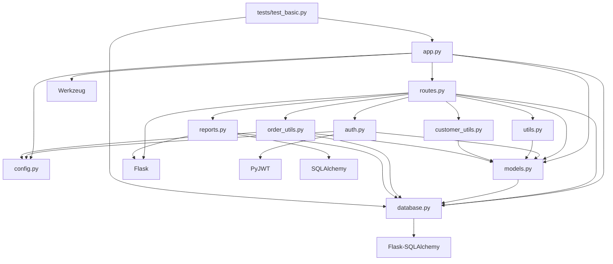
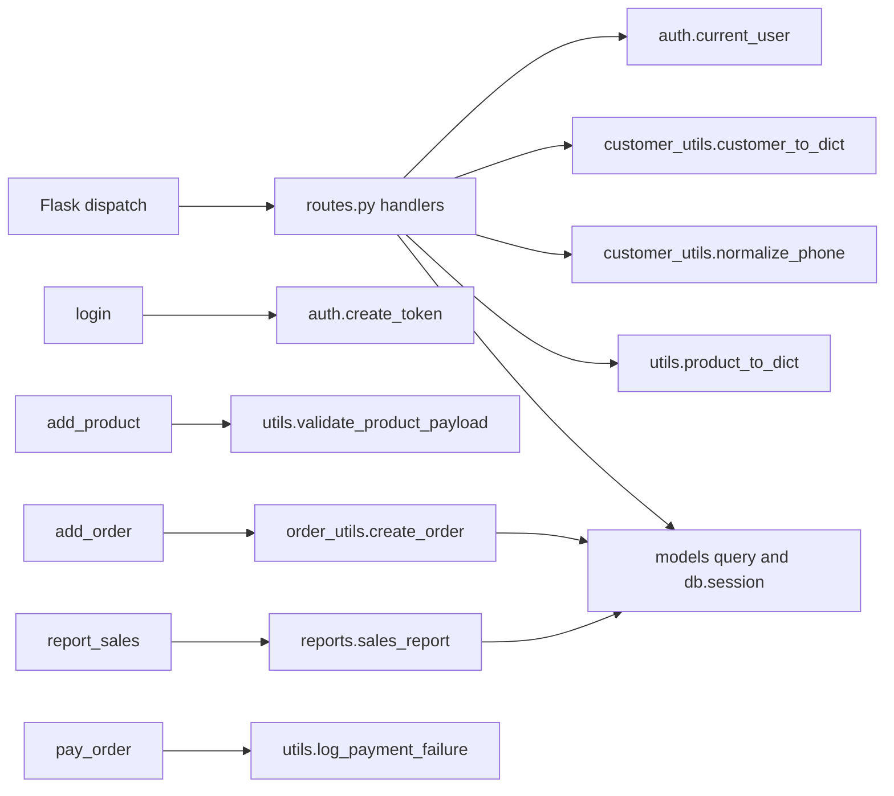

# Dependency Graph

## Overview

The code uses direct module imports rather than an explicit dependency injection or repository layer. The dominant direction is `app.py` -> `routes.py` -> auth/helpers/domain/database. ORM access is shared directly by routes and helper modules. No circular import was identified in the inspected source import graph.

## Module Dependency Table

| Module | Imports/dependencies | Main callers/importers | Notes |
|---|---|---|---|
| `app.py` | Flask, config, database, models, routes, Werkzeug password hashing | Process runner; tests import `create_app` | Composition/bootstrap module; also seeds data and exposes global app. |
| `routes.py` | Flask, Werkzeug, database, all six models, auth, `utils`, `customer_utils`, `order_utils`, `reports` | `app.py` registers `api`; Flask dispatches handlers | Highest observed fan-out; combines API, policy, ORM calls, and orchestration. |
| `auth.py` | functools, Flask, PyJWT, config, `User` | `routes.py` decorators/functions | Authentication and role guard implementation. |
| `models.py` | datetime, database `db` | app, routes, auth, utils, customer_utils, order_utils | Domain schema; fan-in from most runtime modules. |
| `database.py` | Flask-SQLAlchemy | app, models, routes, order_utils, reports, tests | Owns singleton extension and app initialization. |
| `config.py` | os | app, auth, order_utils | Module-level environment/config values. |
| `order_utils.py` | database, Order/OrderItem/Product, config | `routes.add_order` imports `create_order` | Business workflow directly mutates SQLAlchemy objects/session. |
| `customer_utils.py` | Customer model | routes | Serialization, phone normalization, email lookup. |
| `utils.py` | logging, datetime, Product model | routes | Product serialization/validation, date/stock helpers, logging. |
| `reports.py` | Flask request, SQLAlchemy `text`, database | routes | HTTP-context-dependent SQL report. |
| `tests/test_basic.py` | os, pytest, app factory, database | pytest | Single test module; imports app and database. |

## Module-Level Graph

## Important Call Relationships

Other declared helper functions—`calculate_order_total`, `parse_date`, `check_stock`, and `find_customer_by_email`—have no call sites in the inspected application source. This is a source-level observation, not proof that no external consumer imports them.

## Coupling Assessment

- **High fan-in:** `models.py` is imported by `app.py`, `routes.py`, `auth.py`, `utils.py`, `customer_utils.py`, and `order_utils.py`. `database.py` is imported by app, models, routes, order utilities, reporting, and tests.
- **High fan-out:** `routes.py` imports the broadest set of internal components and coordinates all exposed business workflows. `app.py` is also a composition root importing the main startup dependencies.
- **Tight coupling:** route handlers query and mutate ORM models directly; helper modules also depend on model classes and global `db`. Reporting depends on Flask's request context as well as persistence.
- **Shared global state:** `database.db` is a module-level SQLAlchemy extension; `app.py` creates module-level app; configuration is loaded into module-level constants.
- **Circular dependencies:** None observed among repository Python module imports. This judgment is based on static imports in the source files present in the repository; dynamically imported modules are Unknown.
- **Multiple responsibilities:** `routes.py` handles request/response mapping, access policy, validation and persistence/orchestration. `utils.py` contains product concerns, date parsing, inventory checking, and payment logging. `app.py` combines factory/startup, schema bootstrap, seeding, exception handling, and development serving.

## External Package Dependencies

`requirements.txt` declares Flask 3.0.3, Flask-SQLAlchemy 3.1.1, PyJWT 2.9.0, Werkzeug 3.0.4, pytest 8.3.3, and requests 2.32.3. Source imports show Flask, Flask-SQLAlchemy, PyJWT, Werkzeug, pytest, and SQLAlchemy APIs (SQLAlchemy arrives through the environment/Flask-SQLAlchemy dependency; it is not directly listed in `requirements.txt`). No `requests` import is present. The runtime test execution emitted SQLAlchemy `Query.get()` and `datetime.utcnow()` deprecation warnings; package support status beyond these warnings is not assessed here.

## Evidence and Traceability

- Imports at the top of `app.py`, `auth.py`, `config.py`, `customer_utils.py`, `database.py`, `models.py`, `order_utils.py`, `reports.py`, `routes.py`, `utils.py`, and `tests/test_basic.py` establish the static graph.
- `routes.py`: `login`, customer/product/order/payment/report handlers establish call relationships.
- `auth.py`: `current_user`, `create_token`, guards.
- `order_utils.py`: `calculate_order_total`, `create_order`.
- `utils.py`: `product_to_dict`, `validate_product_payload`, `parse_date`, `check_stock`, `log_payment_failure`.
- `customer_utils.py`: `customer_to_dict`, `normalize_phone`, `find_customer_by_email`.
- `reports.py`: `sales_report`.
- `requirements.txt`: declared package set; `tests/test_basic.py` and runtime pytest output establish exercised paths and deprecation warnings.