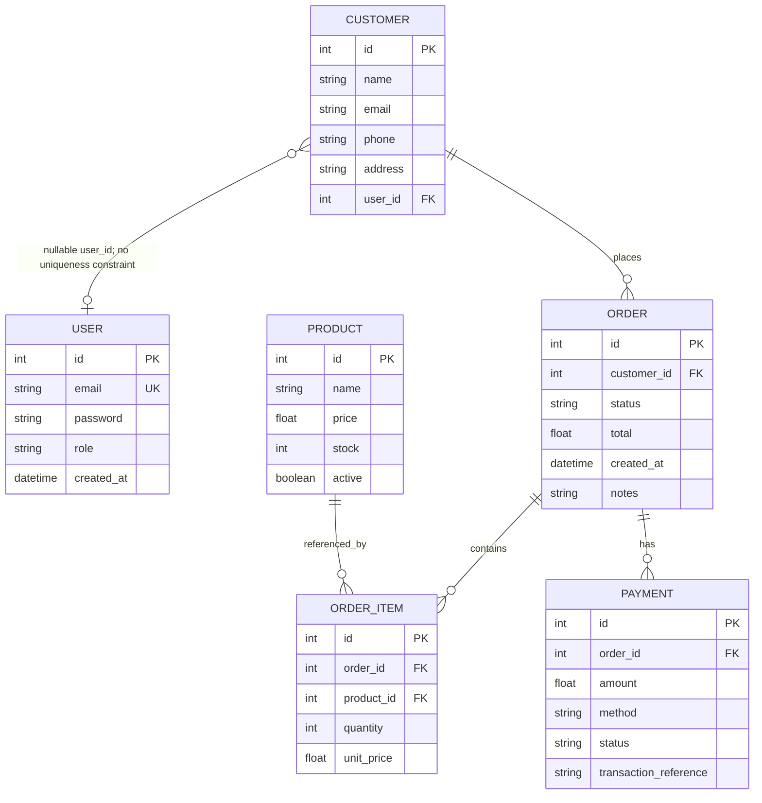

# Domain Map

## Domain Concepts

| Concept | Data structure | Related functions/services | API surface | Relationships and rules evidenced in code |
|---|---|---|---|---|
| User / account | `models.User`: unique non-null email, password hash field, role, created timestamp. | `register`, `login`, `auth.create_token`, `auth.current_user`, guards; `app.seed_data`. | `POST /api/register`, `POST /api/login`; used indirectly on guarded endpoints. | Registration creates customer-role account, hashes password, checks for existing email, then creates a Customer with that user's ID. Seed creates admin and two customer accounts. User-to-Customer is represented by nullable `Customer.user_id` FK; uniqueness/one-to-one is not enforced in schema. |
| Customer | `models.Customer`: name, email, optional phone/address, optional user FK. | `customer_to_dict`, `normalize_phone`, `find_customer_by_email`; customer CRUD and order lookup handlers. | `GET/POST /api/customers`, `GET/PUT/DELETE /api/customers/<id>`. | Orders have required `customer_id` FK. Listing is global to any authenticated user; detail/update are authenticated without ownership filtering; deletion is admin-guarded. |
| Product | `models.Product`: name, description, float price, stock integer, active boolean. | Product serialization/validation; `order_utils.create_order` reads price and decrements stock; `utils.check_stock` helper. | Public `GET /api/products` and `GET /api/products/<id>`; guarded `POST/PUT /api/products`. | Collection filters `active=True`; detail lookup does not visibly apply active filter. Creation validates name/price/negative price or stock and defaults stock to 0. Updating accepts name/price/stock without using that validator. Orders snapshot current price into item `unit_price`. |
| Order | `models.Order`: customer FK, status, float total, creation timestamp, notes. | `order_utils.create_order`; route handlers list/detail/create/status/delete/pay. | `GET/POST /api/orders`, `GET/PUT/DELETE /api/orders/<id>`, plus nested payment routes. | Creation initializes status `NEW`, computes line subtotal plus configured tax, and decrements stock. Status update accepts `NEW`, `PROCESSING`, `SHIPPED`, `CANCELLED`. Orders list is admin-wide or customer-filtered; other order-level actions only require login in source. |
| Order item | `models.OrderItem`: order FK, product FK, integer quantity, float unit price. | Created in `order_utils.create_order`, read in `get_order`, explicitly deleted in `delete_order`. | Nested representation in `GET /api/orders/<id>`; created through `POST /api/orders`. | Each submitted item must reference an existing product and positive quantity; stock must be sufficient. Stored `unit_price` comes from product at creation. Explicit delete removes items before order. |
| Payment | `models.Payment`: order FK, float amount, method/status/reference, timestamp. | `pay_order`, `get_payment`, `delete_order`, `utils.log_payment_failure`. | `POST/GET /api/orders/<id>/payment`. | Payment requires positive amount equal to order total and rejects when a prior payment exists. Card method rejects card number shorter than 12 and logs the supplied number. Successful payment creates local row and moves order status to `PROCESSING`; no external processor call appears. `Payment.status` defaults `PAID`. |
| Sales report | No report model; derived aggregate over `orders`. | `reports.sales_report`, `routes.report_sales`. | Admin-guarded `GET /api/reports/sales`; `start`/`end` query parameters default to 2000-01-01 and 2100-01-01. | Aggregates count and sum(total) grouped by status, filtered by created_at bounds. Implementation interpolates parameters into SQL text. |
| Tax | Configuration constant `TAX_RATE = 0.18`; no domain model. | `calculate_order_total`, `create_order`. | Reflected in created order total. | Order helper adds 18% to subtotal and rounds to two decimal places. |
| Inventory | `Product.stock`; no separate inventory/adjustment model. | `order_utils.create_order`; `utils.check_stock`. | Read indirectly through product endpoints; changed during order creation and product update. | Helper checks stock before decrement; standalone `check_stock` only compares current stock and quantity and is unused in source. |

## Domain Relationship Diagram

The diagram reflects the declared foreign keys; it does not imply ORM relationship properties, which are not declared. User/Customer and Order/Payment are not constrained to one-to-one in the schema. The Mermaid labels' conceptual singular/plural language must not be read as additional database constraints.

## Business Rules and Behavior

### Explicitly Implemented Rules

- Registration requires email, password, and name; an existing exact email match returns 409. Password is stored using `generate_password_hash`; new account role is `customer`.
- Login returns 401 for missing user or failed password verification; successful response includes token and role.
- Product creation requires a truthy name and non-null price, rejects negative price and negative provided stock, and converts price/stock to float/int.
- Order creation requires `customer_id` and a non-empty items value at the route; each product must exist, quantity must be positive, and stock must cover quantity. The helper decrements stock and creates item rows, uses product's current price, adds `TAX_RATE`, and commits.
- Payment amount must be positive and exactly equal the stored order total. A payment row already found for the order yields 409. Card payments with a number shorter than 12 characters fail. On success a payment row is added and order status is set to `PROCESSING`.
- Status endpoint accepts only the four literal statuses `NEW`, `PROCESSING`, `SHIPPED`, `CANCELLED`.
- `/api/products` collection omits inactive products; its item endpoint does not filter by `active`.

### Behavior Inferred from Implementation

- The order flow appears intended to capture a price snapshot in `OrderItem.unit_price`, since the current product price is copied at creation. No later recalculation behavior is shown.
- `orders` intends to scope a non-admin's order list to the first customer found for their user ID; if no customer exists, it returns an empty list.
- The one-payment check and fixed-looking `TXN-<order_id>-001` reference indicate an intended single local payment per order. The database schema itself does not declare a uniqueness constraint for payment/order.
- Payment is a local state transition/record, not evidence of an actual funds transfer; gateway/settlement behavior is Unknown because no external integration is called.

### Unknown Behavior / Not Established

- Whether status transitions should be constrained by prior status; current endpoint accepts any listed status at any time.
- Whether deleted customers/orders should be blocked, cascaded, or retained; model foreign keys have no explicit `ondelete` and ORM relationships/cascades are absent. Actual behavior may depend on database FK enforcement/configuration.
- Whether money precision/rounding is acceptable: fields are SQLAlchemy `Float`; expected currency precision policy is Unknown.
- Whether customer email must be unique, customer-to-user must be unique, or every user must have a customer record; not enforced in model schema.
- Whether inactive products should be unavailable by ID or in order submission; order creation checks existence and stock, not `active`.
- Whether card-number validation should use a particular format or payment-method set; only the minimum length condition for `card` is enforced, and behavior for other methods is not otherwise constrained in the route.
- Whether payment amount equality should use exact decimal comparison; the implementation compares floating-point values directly.
- Whether user/customer cardinality or payment/order cardinality is meant to be one-to-one; the schema permits multiple linked records where foreign keys allow it.
- Whether deployment runs an external payment processor, migrations, or background jobs; none is evidenced in this repository.

## Evidence and Traceability

- `models.py`: model columns, foreign keys, nullability, defaults, and declared constraints for all six entities.
- `routes.py`: `register`, `login`, customer/product/order/payment/report endpoint behavior, validations, access guards, and status/payment transitions.
- `auth.py`: token contents and user/role lookup behavior.
- `order_utils.py`: `calculate_order_total` and `create_order`, including tax, stock, and item price behavior.
- `customer_utils.py`: customer serialization, phone normalization, and email lookup.
- `utils.py`: product serialization/validation, stock helper, date parser, and failed-payment logging.
- `reports.py`: sales aggregation, request date defaults, SQL filters, and grouping.
- `config.py`: tax rate and other module-level configuration values.
- `app.py`: seed users/customers/products and application startup behavior.